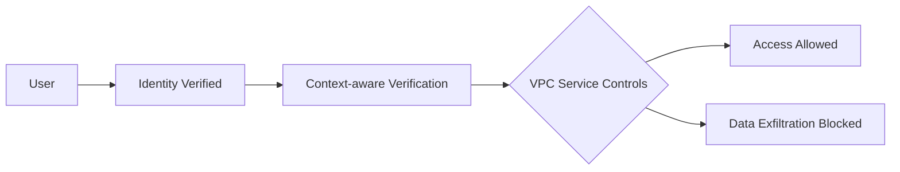
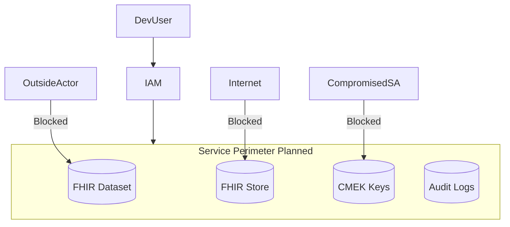

# 🧪 Lab 03 — Zero-Trust Perimeter (VPC Service Controls) — Simulated Mode
### *Design Google's strongest PHI protection boundary (Zero Trust Layer 4) without deploying resources.*

---

# 📘 1. THEORY — What Is VPC Service Controls?

VPC-SC establishes a **virtual security perimeter** around Google Cloud services.  
It prevents **data exfiltration** even when:

- IAM is misconfigured  
- Credentials leak  
- Malware compromises a VM  
- Insider access occurs  

### **Analogy**  
Think of VPC-SC as a **security moat** around your hospital data center.  
You may enter the building (IAM), but you cannot leave the perimeter with sensitive PHI data.

---

# 🧠 2. Zero-Trust Architecture Flow

# 🗂 3. Planned VPC-SC Architecture (Simulated)

**In a real deployment, VPC-SC would protect:**

FHIR Store

Healthcare datasets

CMEK keys

Logging + monitoring

In Simulated Mode, we design the perimeter but do not apply it.

# 🔧 4. Terraform VPC-SC Module (Simulated)
This Terraform module represents the perimeter configuration without creating anything.

File: terraform/vpc-sc/main.tf

##############################################
# Terraform VPC Service Controls (SIMULATED)
##############################################

terraform {
  required_version = ">= 1.5.0"
}

variable "perimeter_name" {
  description = "Name of the service perimeter"
  default     = "stc-health-perimeter"
}

variable "protected_projects" {
  description = "List of protected project IDs"
  type        = list(string)
  default     = ["stc-health-primary", "stc-health-security"]
}

output "note" {
  value = "VPC-SC module (Simulated Mode) — no perimeter created."
}

# 🛠 5. Zero-Trust Policy Design
Perimeter Enforces:
Block data access from outside Google Cloud

Block exfiltration to storage buckets outside perimeter

Restrict API Gateway → FHIR Store to approved service accounts

Force Cloud Run → FHIR Store via VPC-SC connector

Prevent curl or API calls from public networks

None of these are deployed in Simulated Mode — but the design is included for portfolio authenticity.

# 🔍 6. Validation Checklist (Simulated)
✔ Terraform module exists
✔ README.md describes full Zero-Trust model
✔ Mermaid architecture included
✔ IAM security model outlined
✔ No GCP perimeter deployed
✔ No billing incurred

# 🛡 7. HIPAA Mapping
HIPAA Control	How Lab 03 Satisfies It
§164.312(a)(1)	Access Control via perimeter restriction
§164.312(c)(1)	Integrity via containment boundaries
§164.312(e)(1)	Transmission security through private-only access
§164.308(a)(1)	Security management system design

# 🎉 Lab 03 Complete (Simulated Mode)
You now have:
✔ Zero-Trust perimeter architecture
✔ Terraform VPC-SC module
✔ IAM & boundary planning
✔ PHI exfiltration prevention modeling
✔ No GCP charges

Next up:
Lab 04 — CMEK Encryption (Simulated Mode)

