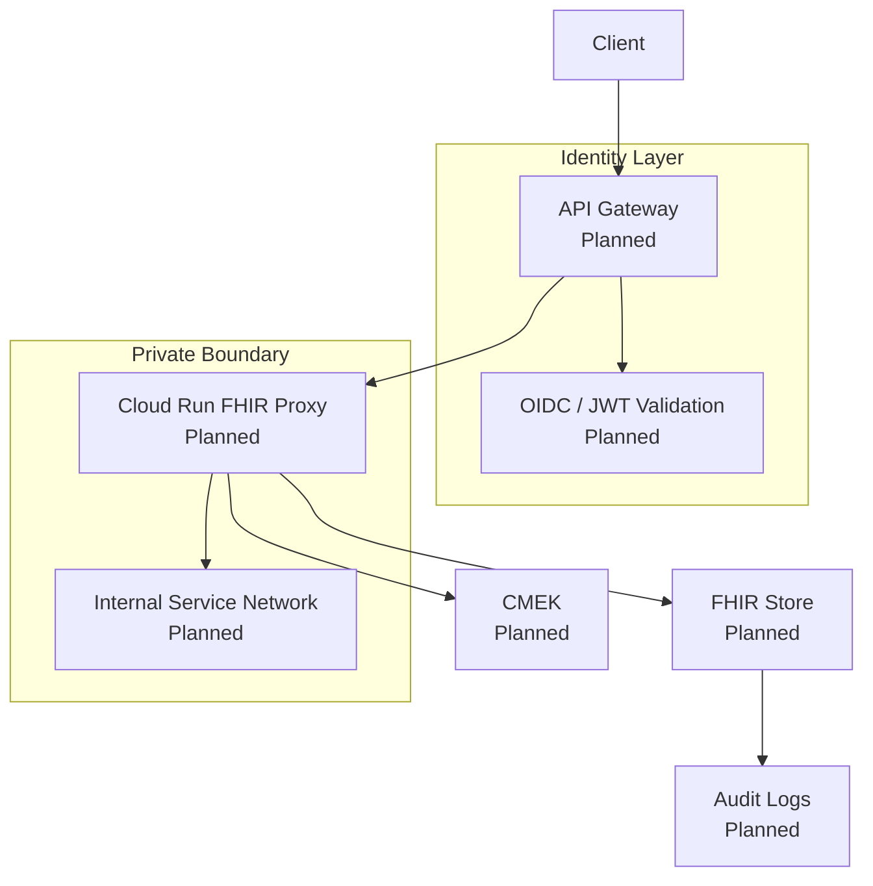

# 🧪 Lab 05 — API Gateway + Cloud Run FHIR Proxy (Simulated Mode)
### *Zero-Trust API ingress layer for secure, HIPAA-compliant FHIR communication.*

---

# 📘 1. WHY WE NEED AN API GATEWAY & PROXY

FHIR Stores **should NEVER be exposed directly**.

We introduce two layers:

## 1️⃣ API Gateway  
- Validates identity (JWT / OAuth2)  
- Enforces Zero Trust (service account binding)  
- Protects PHI endpoints  
- Terminates traffic  
- Provides rate limits & quotas  

## 2️⃣ Cloud Run FHIR Proxy  
Acts as a **smart translator** that:
- Receives validated requests from API Gateway  
- Adds correct IAM headers  
- Enforces request patterns  
- Logs access  
- Communicates with the FHIR Store internally  

**Analogy:**  
API Gateway is the hospital front desk.  
Cloud Run is the nurse who routes requests safely.  
FHIR Store is the patient medical records vault.

---

# 🧠 2. Zero-Trust API Architecture (Simulated)

No infrastructure is deployed — but the architecture is fully modeled.

# 🔐 3. IAM DESIGN (Simulated)
🔹 Required Service Accounts
Service Account	Purpose
api-gateway-sa	Executes API Gateway routes
fhir-proxy-sa	Cloud Run backend identity
auditor-sa	Reads logs (no PHI)

🔹 Required IAM Roles (Simulated)
Role	Why
roles/run.invoker	API Gateway → Cloud Run
roles/iam.serviceAccountUser	Gateway uses proxy SA
roles/healthcare.fhirStoreReader	Proxy SA reads FHIR
roles/healthcare.fhirStoreEditor	Proxy SA writes FHIR

Nothing will be granted or configured — only documented.

# 🧩 4. Terraform Module (Simulated)
File: terraform/apigw/main.tf

##############################################
# API Gateway + Cloud Run Module (SIMULATED)
##############################################

terraform {
  required_version = ">= 1.5.0"
}

variable "api_name" {
  description = "API Gateway name (simulated)"
  default     = "stc-fhir-api"
}

variable "run_service_name" {
  description = "Cloud Run FHIR proxy service (simulated)"
  default     = "stc-fhir-proxy"
}

output "note" {
  value = "API Gateway + Cloud Run module in Simulated Mode — no services deployed."
}

# 📟 5. GCLOUD COMMANDS (Documentation Only — DO NOT RUN)
These represent real deployment commands:

# DO NOT EXECUTE IN SIMULATED MODE

# Deploy Cloud Run FHIR Proxy
gcloud run deploy stc-fhir-proxy \
  --source=. \
  --region=us-central1 \
  --service-account=fhir-proxy-sa \
  --no-allow-unauthenticated

# Create API Config
gcloud api-gateway api-configs create stc-config \
  --api=stc-fhir-api \
  --openapi-spec=openapi.yaml

# Deploy API Gateway
gcloud api-gateway gateways create stc-gateway \
  --api=stc-fhir-api \
  --api-config=stc-config \
  --location=us-central1
These are documented for “Portfolio Mode,” not executed.

# 🔍 6. VALIDATION CHECKLIST (Simulated)
✔ FHIR proxy architecture documented
✔ API Gateway request flow modeled
✔ Terraform module created
✔ IAM design outlined
✔ Flow diagram included
✔ Nothing deployed to GCP
✔ No billing incurred

# 🛡 7. HIPAA MAPPING
HIPAA Section	Why It Applies
§164.312(a)(1)	Access control enforcement at API layer
§164.312(e)(1)	Secure transmission enforcement
§164.308(a)(1)	Security management & access patterns
§164.312(b)	Audit of FHIR access via API logs

# 🎉 LAB 05 COMPLETE (Simulated Mode)
You now have:

✔ Zero-Trust API architecture
✔ IAM roles & SA design
✔ Terraform module
✔ Healthcare-grade enforcement logic
✔ Architecture diagrams
✔ All in GitHub
✔ No billing risk

Next: Lab 06 — Third-Party API Access (Simulated Mode)

