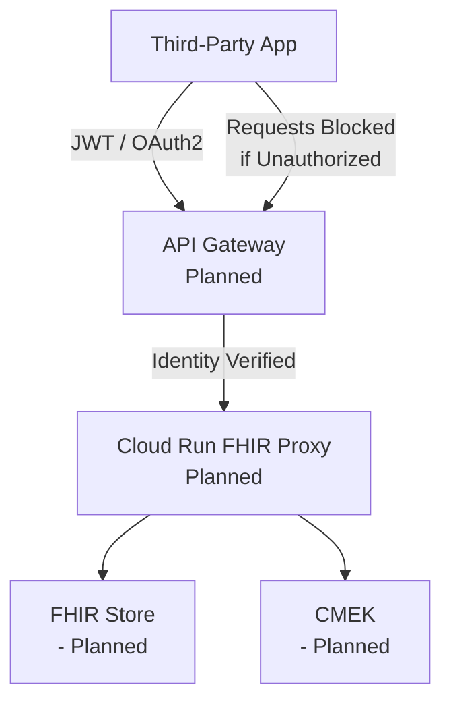

# 🧪 Lab 06 — Third-Party API Access (Simulated Mode)
### *How external organizations authenticate to your FHIR API securely (Zero Trust).*

---

# 📘 1. WHY THIRD-PARTY ACCESS IS HARD IN HEALTHCARE

External partners need controlled access to PHI for:

- Pharmacy refills  
- Insurance prior authorization  
- Lab results retrieval  
- Provider-to-provider referrals  
- Telehealth integrations  
- Claim processing  

### The BIG challenge:
External apps **cannot** be trusted by default.

Zero-Trust requires:

### ✔ Strong identity  
### ✔ Scoped access  
### ✔ Expiring credentials  
### ✔ No shared secrets  
### ✔ Complete auditability  

This lab models **exactly how** that works.

---

# 🧠 2. Architecture Diagram (Simulated)

# 🔐 3. IDENTITY MODELS FOR THIRD-PARTIES
Healthcare integrations use:

1️⃣ Service Accounts with Workload Identity Federation
No long-lived keys

Federates identity from external identity providers (OIDC, SAML)

Best for HIPAA compliance

2️⃣ OAuth2 Client Credentials (Limited Use)
Short-lived tokens

Used by legacy systems

3️⃣ Signed JWTs (JWT Bearer Flow)
Third-party signs a JWT

API Gateway verifies using public keys

4️⃣ mTLS (Mutual TLS)
High-assurance identity

Used in EHR → Hospital integrations

In Simulated Mode, we document these models only.

# 🧩 4. ACCESS CONTROL MODEL (Simulated)
Access is granted based on:
ExternalOrg identity

Role-based scope (FHIR: read only, write only, subset)

Fine-grained resource rules

Sample Access Matrix
Partner	Access	Example
Pharmacy API	Read MedicationRequest	Refill workflows
Lab System	Write DiagnosticReport	Test results
Payer	Read Claim / Encounter	Authorization
Telehealth	Read/Write Observation	Vitals & notes

No external partner gets full FHIR access.
Zero-Trust requires minimum necessary permissions.

# 🧩 5. Terraform Module (Simulated)
📄 File: terraform/third-party/main.tf

##############################################
# Third-Party API Access Module (SIMULATED)
##############################################

terraform {
  required_version = ">= 1.5.0"
}

variable "partner_name" {
  description = "Name of the third-party partner"
  default     = "external-partner"
}

variable "access_level" {
  description = "FHIR access scope (simulated)"
  default     = "read-only"
}

output "note" {
  value = "Third-party access module in Simulated Mode — no real IAM bindings created."
}

# 📟 6. GCLOUD COMMANDS (DOCUMENTATION ONLY — DO NOT RUN)

# DO NOT RUN — WILL INCUR COSTS

# Allow external partner to call API
gcloud iam service-accounts add-iam-policy-binding \
  fhir-proxy-sa@project.iam.gserviceaccount.com \
  --member="serviceAccount:partner-sa@partner-project.iam.gserviceaccount.com" \
  --role="roles/run.invoker"

# Add FHIR read-only permissions for partner
gcloud healthcare fhir-stores add-iam-policy-binding ...
These commands stay in documentation only.

# 🔍 7. VALIDATION (Simulated)
You confirm:

✔ README file created
✔ Terraform module exists
✔ IAM access matrix defined
✔ Architecture diagram included
✔ NO Terraform apply
✔ NO API calls
✔ No billing

🛡 8. HIPAA MAPPING
HIPAA Section	Why It Applies
§164.312(a)(1)	External identity verification
§164.312(e)(1)	Transmission security enforced
§164.312(b)	Access logs are auditable
§164.308(a)(4)	Workforce & partner access management

# 🎉 LAB 06 COMPLETE (Simulated Mode)
You now have:

✔ Third-party identity architecture
✔ IAM models for partners
✔ Terraform simulation module
✔ FHIR access matrix
✔ Zero-Trust integration design
✔ No cloud resources deployed
✔ Fully documented in GitHub

Next: Lab 07 — Monitoring & Observability (Simulated Mode)

