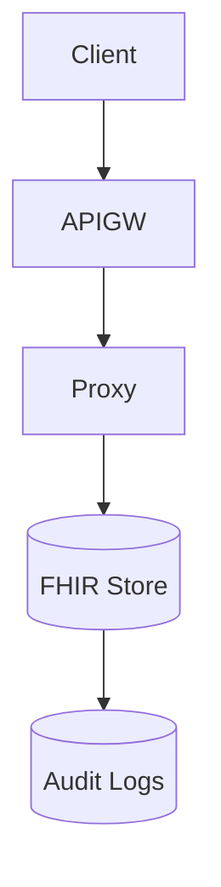

# 📘 FHIR Security — Protecting PHI in API Workflows

## 🔐 1. Why FHIR Must Be Secured

FHIR contains:

Patient identity

Lab results

Diagnoses

Medications

Telehealth notes

A breach exposes highly sensitive PHI.

## 🧱 2. FHIR Security Layers (Simulated)

Identity
OAuth2, JWT, mTLS

API Gateway
Zero-trust traffic filtering

Cloud Run Proxy
Internal identity translation

VPC-SC
Blocks exfiltration

CMEK
Encryption for all FHIR data

Audit Logs
Every access recorded

## 🧩 3. Architecture Diagram

## 📜 4. HIPAA Mapping

FHIR Security supports:

§164.312(a)(1): Access Control

§164.312(b): Audit Controls

§164.312(c)(1): Integrity

§164.312(e)(1): Transmission Security

