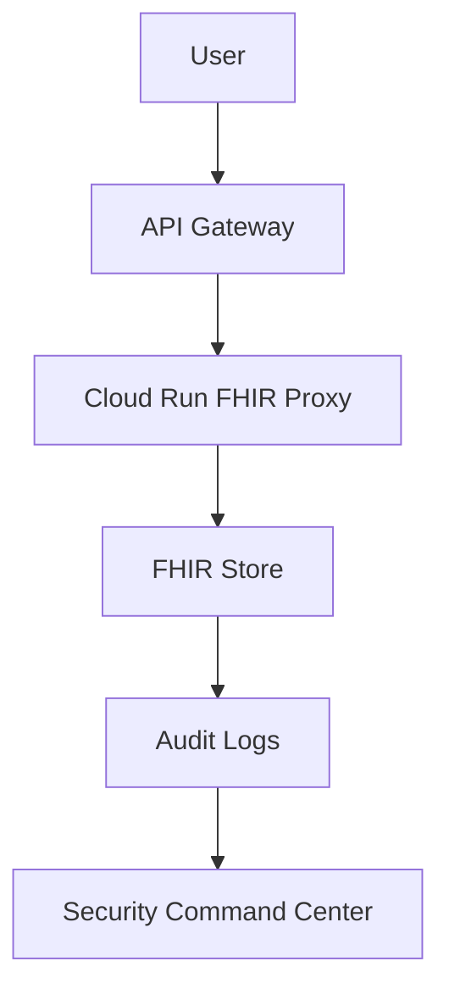

# 📘 HIPAA Safeguards — Administrative, Physical & Technical  
### *Hybrid Explanation (Textbook + Analogy + Architecture)*

---

# 📙 1. What Are HIPAA Safeguards?
HIPAA defines **three categories of safeguards** for protecting PHI:

1. **Administrative safeguards** – policies, workforce, procedures  
2. **Physical safeguards** – secure access, facility controls  
3. **Technical safeguards** – encryption, access control, audit logging  

For cloud architectures, **Technical Safeguards** are the primary focus.

---

# 🏥 2. The Hospital Analogy  
Think of PHI like a patient inside a hospital:

- **Administrative** = hospital policies, training, SOPs  
- **Physical** = doors, locks, keycards, cameras  
- **Technical** = digital locks, logs, authentication, encryption  

Google Cloud implements the technical equivalents through IAM, CMEK, VPC-SC, logs, and monitoring.

---

# 🔐 3. Technical Safeguards Mapped to GCP

| HIPAA Requirement | GCP Equivalent | How You Implement It |
|------------------|----------------|-----------------------|
| Access Control | IAM, API Gateway | Enforce least privilege |
| Audit Controls | Cloud Logging | Every FHIR access logged |
| Integrity | CMEK, IAM, Signed Requests | Prevent tampering |
| Transmission Security | HTTPS, JWT, mTLS | Zero-trust data flow |
| Authentication | OAuth2, SA Identity | Verified identity before access |

---

# 🧠 4. Safeguards Architecture (Simulated)

This diagram shows how technical safeguards layer together to protect PHI.

# 🔍 5. Your Role as a Cloud Security Architect
You design and enforce:

IAM boundaries

Encryption policies

Zero-trust networking

Audit strategy

Monitoring and alerting

Compliance architecture

In this course, each lab builds one HIPAA safeguard.

# 🛡 6. HIPAA Mapping Summary
✔ §164.308 – Administrative Safeguards
✔ §164.310 – Physical Safeguards
✔ §164.312 – Technical Safeguards

All future labs align to §164.312.

